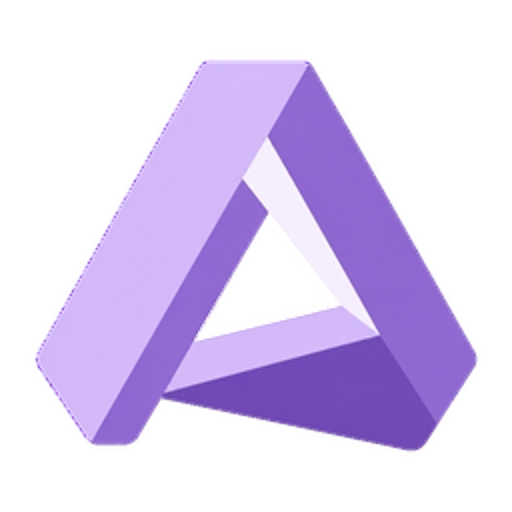

<div align="center">
  

  <h1>Aura Launcher</h1>

  <p><strong>面向下一代插件生态的跨平台 Minecraft 启动器</strong><br>
  <em>A cross-platform Minecraft launcher built for the next generation of plugins</em></p>

  <p>
    <a href="https://github.com/Egg-China/Aura-Launcher/actions/workflows/gradle.yml"></a>
    
    
    <a href="LICENSE"></a>
  </p>

  <p><a href="#简体中文">简体中文</a> · <a href="#english">English</a></p>
</div>

## 简体中文

### 关于 Aura Launcher

Aura Launcher 是由 Egg-China 开发的跨平台 Minecraft 启动器。它保留成熟的游戏安装、实例管理和启动能力，并以独立的插件架构、安全边界与发布体系面向未来持续演进。

> [!IMPORTANT]
> Aura Launcher 当前处于 **Next 开发阶段**，尚未提供稳定版本。此仓库产生的构建版本均以 `-next` 结尾，发布文件统一命名为 `Aura-Launcher-<version>.jar`。

### 特性

- **跨平台运行**：面向 Windows、Linux、macOS 与 FreeBSD，并覆盖多种 CPU 架构；详见[平台支持表](docs/PLATFORM_zh.md)。
- **完整实例管理**：安装、组织和启动多个 Minecraft 实例，管理游戏版本与模组加载器。
- **新一代插件系统**：Aura `.npl` 插件使用 manifest schema v5，并接受权限、平台、Runtime 与 ABI 兼容性检查。
- **清晰的安全边界**：Aura Launcher 使用独立数据目录；迁移仅复制明确允许的设置，不导入插件或插件安全状态。

> [!TIP]
> **HarmonyOS PC（ARM64，实验性）** 作为独立平台识别。HarmonyOS PC 使用 Linux 内核，因此
> Linux ARM64 插件制品原则上可能运行；但 Aura Launcher、JavaFX、Minecraft 启动以及所有外部
> Runtime Host 均未在 HarmonyOS PC 真机上测试。详见 [English](docs/PLATFORM.md)、
> [简体中文](docs/PLATFORM_zh.md)、[繁體中文](docs/PLATFORM_zh_Hant.md)平台页与
> [HarmonyOS 打包说明](packaging/harmonyos/README.md)。

### 获取与构建

当前没有稳定版本可供下载。拥有仓库访问权限的测试者可从 [GitHub Actions](https://github.com/Egg-China/Aura-Launcher/actions/workflows/gradle.yml?query=branch%3Amain) 获取最新 Next 构建。

从源代码构建需要 **JDK 17 或更高版本**。

```powershell
# Windows
.\gradlew.bat :AuraLauncher:build --no-daemon
```

```bash
# Linux / macOS
./gradlew :AuraLauncher:build --no-daemon
```

构建产物位于 `AuraLauncher/build/libs/`。在开发环境中运行启动器：

```powershell
.\gradlew.bat :AuraLauncher:run --no-daemon
```

### 插件与开发文档

- [插件系统](AuraPluginSystem/docs/PLUGIN_SYSTEM.md)：插件清单、权限与来源管理
- [插件契约](AuraPluginSystem/docs/PLUGIN_CONTRACT.md)：启动器与插件之间的行为保证
- [Next 插件架构](AuraPluginSystem/docs/NEXT_PLUGIN_ARCHITECTURE.md)：schema v5 与 Runtime 架构
- [贡献指南](docs/Contributing_zh.md)：开发环境、构建流程与调试选项

发现问题或有功能建议，请[提交 Issue](https://github.com/Egg-China/Aura-Launcher/issues/new/choose)；代码贡献可通过 [Pull Request](https://github.com/Egg-China/Aura-Launcher/compare) 提交。

### 来源

Aura Launcher 基于既有开源代码持续开发，同时保持独立的产品身份、数据目录、发布渠道和插件生态。来源记录、保留声明与兼容性边界见[迁移来源说明](docs/MIGRATION_PROVENANCE.md)。

### 许可证

- [`AuraPluginSystem/`](AuraPluginSystem/) 使用 [Apache License 2.0](AuraPluginSystem/LICENSE)。
- 其他所有目录使用根目录的 [GNU General Public License v3.0](LICENSE)，除非文件另有说明。

完整 Aura Launcher 发行物包含 GPL 覆盖的代码，因此整体仍须遵守 GPLv3。

## English

### About Aura Launcher

Aura Launcher is a cross-platform Minecraft launcher developed by Egg-China. It retains mature game installation, instance management, and launch capabilities while evolving through an independent plugin architecture, security model, and release pipeline.

> [!IMPORTANT]
> Aura Launcher is currently on the **Next development line** and does not yet provide a stable release. Every build from this repository ends in `-next`, and distributable files use the name `Aura-Launcher-<version>.jar`.

### Features

- **Cross-platform support**: Targets Windows, Linux, macOS, and FreeBSD across multiple CPU architectures. See the [platform support matrix](docs/PLATFORM.md).
- **Complete instance management**: Install, organize, and launch multiple Minecraft instances while managing game versions and mod loaders.
- **Next-generation plugin system**: Aura `.npl` plugins use manifest schema v5 and are checked for permission, platform, Runtime, and ABI compatibility.
- **Explicit security boundaries**: Aura Launcher uses its own data directory. Migration copies only allowlisted settings and never imports plugins or plugin security state.

> [!TIP]
> **HarmonyOS PC (ARM64, experimental)** is recognized as a separate platform. HarmonyOS PC uses a
> Linux kernel, so Linux ARM64 plugin artifacts may work in principle; however, Aura Launcher,
> JavaFX, Minecraft launching, and every external Runtime Host remain untested on real HarmonyOS PC
> hardware. See the platform pages in [English](docs/PLATFORM.md),
> [Simplified Chinese](docs/PLATFORM_zh.md), and
> [Traditional Chinese](docs/PLATFORM_zh_Hant.md), plus the
> [HarmonyOS packaging guide](packaging/harmonyos/README.md).

### Get and build

No stable download is available yet. Testers with repository access can obtain current Next builds from [GitHub Actions](https://github.com/Egg-China/Aura-Launcher/actions/workflows/gradle.yml?query=branch%3Amain).

Building from source requires **JDK 17 or later**.

```powershell
# Windows
.\gradlew.bat :AuraLauncher:build --no-daemon
```

```bash
# Linux / macOS
./gradlew :AuraLauncher:build --no-daemon
```

Build artifacts are written to `AuraLauncher/build/libs/`. Run the launcher in a development environment with:

```powershell
.\gradlew.bat :AuraLauncher:run --no-daemon
```

### Plugin and development documentation

- [Plugin system](AuraPluginSystem/docs/PLUGIN_SYSTEM.md): manifests, permissions, and source management
- [Plugin contract](AuraPluginSystem/docs/PLUGIN_CONTRACT.md): behavioral guarantees between the launcher and plugins
- [Next plugin architecture](AuraPluginSystem/docs/NEXT_PLUGIN_ARCHITECTURE.md): schema v5 and Runtime architecture
- [Contributing guide](docs/Contributing.md): development setup, build workflow, and debugging options

Please [open an issue](https://github.com/Egg-China/Aura-Launcher/issues/new/choose) for bugs and feature requests. Code contributions are welcome through [pull requests](https://github.com/Egg-China/Aura-Launcher/compare).

### Provenance

Aura Launcher continues from established open-source code while maintaining its own product identity, data directory, release channel, and plugin ecosystem. See the [migration provenance](docs/MIGRATION_PROVENANCE.md) for source records, retained notices, and compatibility boundaries.

### License

- [`AuraPluginSystem/`](AuraPluginSystem/) uses the [Apache License 2.0](AuraPluginSystem/LICENSE).
- All other directories use the root [GNU General Public License v3.0](LICENSE), unless a file states otherwise.

The complete Aura Launcher distribution contains GPL-covered code and therefore remains subject to GPLv3.
